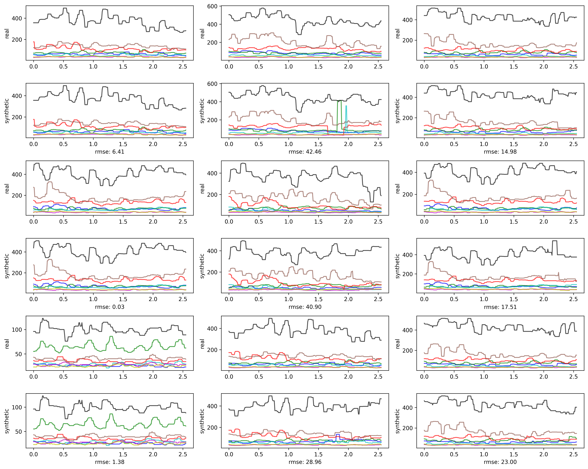
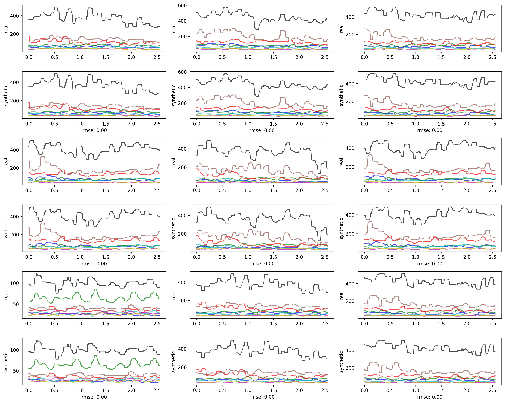

# Reproducing Synthetic Data Generation with ChatEMG

## Training

One ChatEMG model should be trained for each intent (ground truth label of relax/open/close). Once trained, each
such model is
able to generate synthetic data matching its respective intent.

ChatEMG model training with the provided example data file p7_131.csv can be started with the commands as follows:

```sh
cd scripts 
python train.py config/sample_config.py
```

The selected intent class can be modified in the [configuration file](../scripts/config/sample_config.py):

```py
filter_class = 0  # [relax, open, close]
```

It can also be modified directly with the command:

```sh
python train.py config/sample_config.py --filter_class=[0|1|2]
```

The training process typically takes around 24 minutes on one GeForce RTX 4090 GPU.

The ChatEMG model should overfit to the given data file with the provided configuration. The training loss should be under
0.001 and the validation loss should be around 0.003 for the last few checkpoints.

All the model checkpoints during the training process will take around 10GB of disk space.

## Evaluation

With the model checkpoints from the aforementioned training, synthetic EMG data can be generated and evaluated with the
following command:

```sh
python sample.py --ckpt_path [path to checkpoint folder]
```

Sample result plot of the checkpoint at iteration 1000:



Sample result plot of the checkpoint at iteration 30000:


