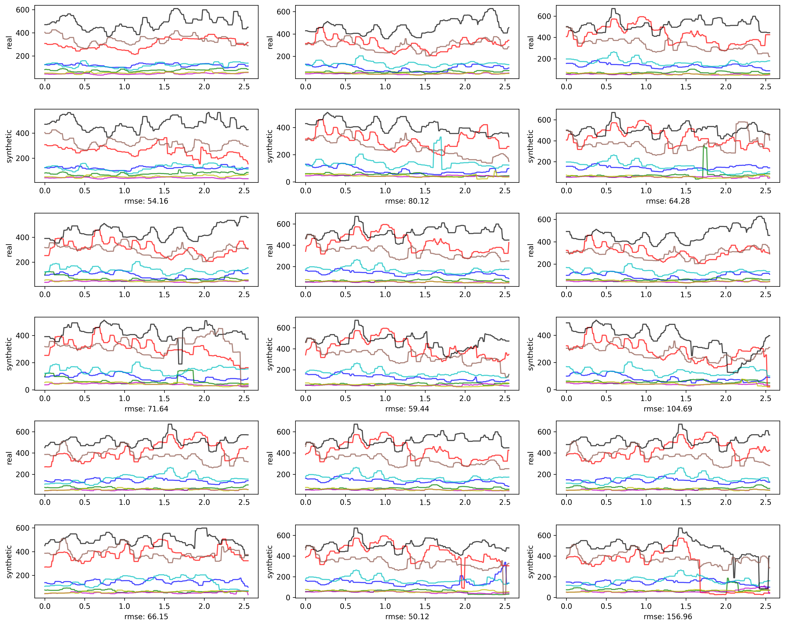

# Setup

Create a virtual environment you prefer :)

Install the required packages with pip and the given requirement.txt

```sh
pip install -r requirements.txt
```

Download our [checkpoints](https://drive.google.com/drive/folders/1U1cD2DtGX5cib6tC5In4Vkt54K2zbtBt) and try to
visualize some synthetic data with sample.py

```sh
cd scripts
python sample.py --ckpt_path "path_to_relax_checkpoint"
```

This command should generate synthetic EMG data plots with the data chunks from
our [given sample data file](../data/p7_131.csv) as prompts.

The result plot should be similar to this:
