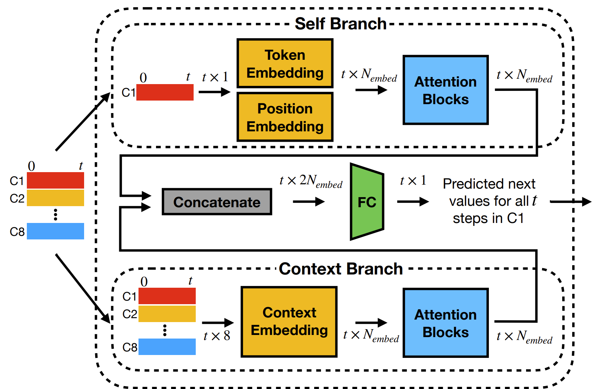

# Codebase Walkthrough

Each ChatEMG model is a Transformer-based decoder-only model with only self-attention mechanisms, similar to
ChatGPT.

## EMG Data

The input to the ChatEMG model consists of a time sequence of 8-channel data from our EMG armband.


For data recording, we instruct the
subjects to open and close their hands three times by giving
verbal cues of open, close, and relax. We simultaneously
record the EMG signals and verbal cues as ground truth
intent labels.


We provide [p7_131.csv](../data/p7_131.csv) as an example data file which contains data recording of three rounds of open-relax-close of
subject S4 in the paper.

While loading data from the data recording files, the EMG signals and ground truth labels can be extracted with our
utility functions. For preprocessing, we
bin and clip each channel of the EMG signal to be an integer
between 0 and 1000. Then the median filter is applied to reduce noises.

The corresponding code segment in [ChatEMGDataset](../scripts/chatemg_dataset.py):

```py
df = pd.read_csv(data_path, index_col=0)
X, y = mu.clean_dataframe(df)
X = np.clip(X, a_min=clip_min, a_max=clip_max)
if median_filter_size != 1:
    X = medfilt(X, kernel_size=[median_filter_size, 1])
```

Each ChatEMG model is trained with EMG sequences of length
t = 256, which corresponds to 2.56 seconds as our armband
collects at 100Hz. The dimension of the model output is
256 × 1, and they are the 256 predicted EMG values for
the next time step of the first channel.

## Two branches

The model of ChatEMG has two branches: the self branch,
which takes in the first channel for which we are predicting
the next EMG value, and the context branch, which takes
in all 8-channel EMG signals.



The self branch uses both token and position embedding layers to compute
the embedding. The context embedding block consists of
8 separate token embedding layers for each channel and
one shared positional embedding layer.

Implementation of context token embedding layer:

```py
class SumTokenEmbedding(nn.Module):
    def __init__(self, config):
        super().__init__()
        self.config = config
        self.embeddings = nn.ModuleList(
            [nn.Embedding(config.vocab_size, config.n_embd) for _ in range(8)]
        )

    def forward(self, x):
        # B, T, C
        x = [self.embeddings[i](x[:, :, i].long()) for i in range(8)]
        return torch.sum(torch.stack(x, dim=-1), dim=-1)
```

## Channel Rotation

The operation of channel rotation will appear twice during ChatEMG training.

Firstly, the input signals are augmented by rotating the channels seven
times to simulate the rotation of the electrodes. This data augmentation strategy enables ChatEMG to be invariant with
channel rotation. We also apply the flip operation to further augment the data recordings for different handedness.

Data augmentation implementation in [ChatEMGDataset](../scripts/chatemg_dataset.py):

```py
# Data augmentation for inter-channel setup
if self.shift:
    augment_list = []
    for d in self.filtered_data_list:
        for i in range(1, 8):  # shift 7 times
            d_shifted = np.roll(d, i, axis=-1)
            augment_list.append(d_shifted)
    for ad in augment_list:
        self.filtered_data_list.append(ad)

if self.flip:
    augment_list = []
    for d in self.filtered_data_list:
        d_flipped = np.flip(d, axis=-1).copy()
        augment_list.append(d_flipped)
    for ad in augment_list:
        self.filtered_data_list.append(ad)
```

Later during data generation, we rotate the input EMG signals 7 times (one channel per time) so that each of the other 7
channels can become the first channel of the input EMG
signals. We then append this newly generated signal to the
input signals and continue the generation process.


We sample EMG
prompts of length 150 (corresponding to 1.5s) from the very
limited dataset of the new condition, session, or subject and
use ChatEMG to autoregressively complete the rest of the
signal to a length of 256, which is the time-series length
that our classification algorithms take.

```py
@torch.no_grad()
def generate(
        self,
        idx,
        max_new_tokens,
        temperature=1.0,
        top_k=None,
        prompt_size=None,
        independent=False,
):
    for _ in range(max_new_tokens):
        idx_cond = (
            idx
            if idx.size(1) <= self.config.block_size
            else idx[:, -self.config.block_size:]
        )
        # go through all channels
        logits, _ = self(idx_cond)
        for c in range(1, 8):
            logits_c, _ = self(idx_cond.roll(shifts=-(int(c)), dims=-1))
            logits = torch.cat((logits, logits_c), dim=1)

        logits = logits.view(logits.shape[0], 1, logits.shape[1], logits.shape[2])

        logits = logits[:, -1, :] / temperature  # (b, 8, 1000)
        # optionally crop the logits to only the top k options
        if top_k is not None:
            v, _ = torch.topk(logits, min(top_k, logits.size(-1)))
            logits[logits < v[:, :, [-1]]] = -float("Inf")
        # apply softmax to convert logits to (normalized) probabilities
        probs = F.softmax(logits, dim=-1)
        # sample from the distribution
        b, emg_c = probs.shape[:2]
        idx_next = torch.multinomial(probs.view(-1, probs.shape[-1]), num_samples=1)
        idx_next = idx_next.view(b, 1, emg_c)  # add back the time dimension

        # append sampled index to the running sequence and continue
        idx = torch.cat((idx, idx_next), dim=1)

    return idx

```